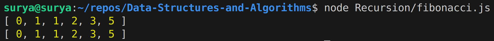
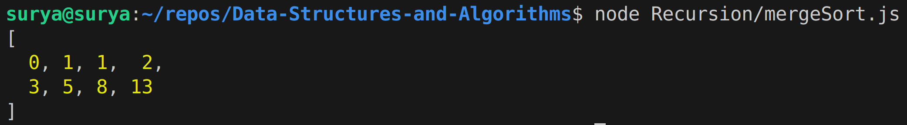
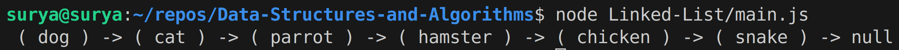
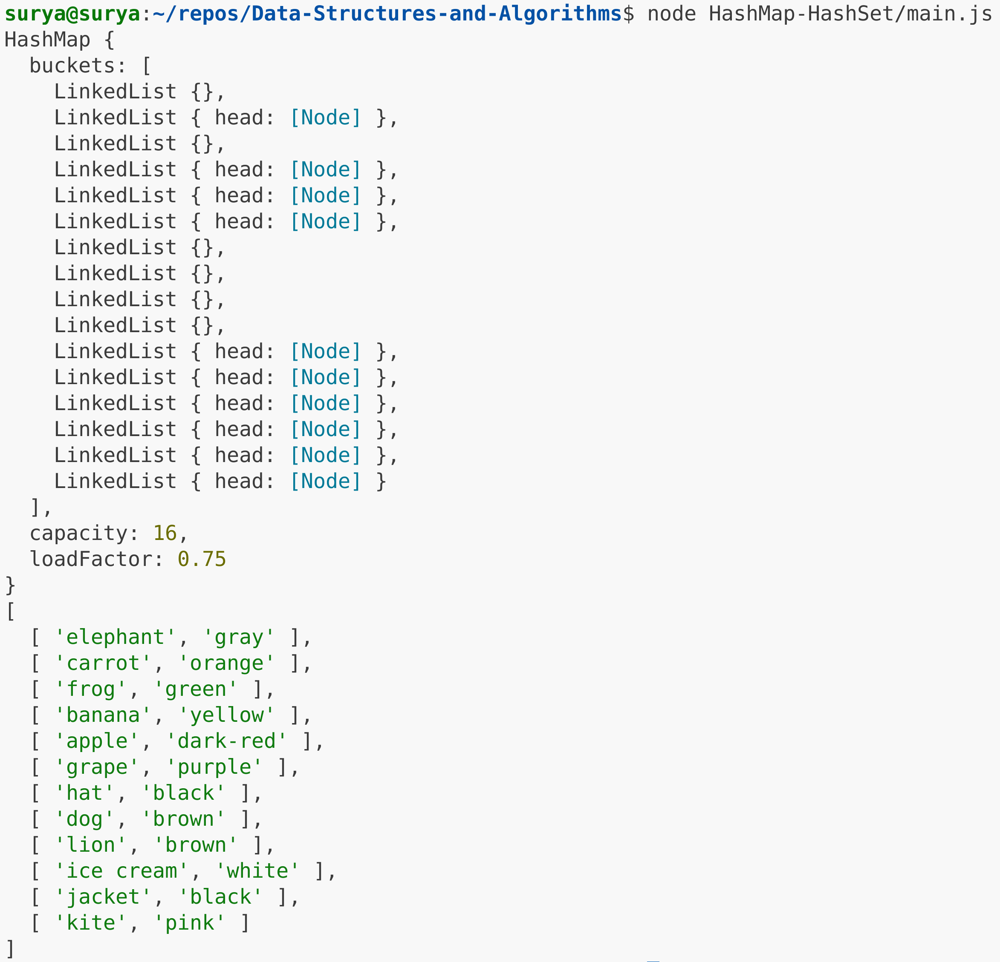
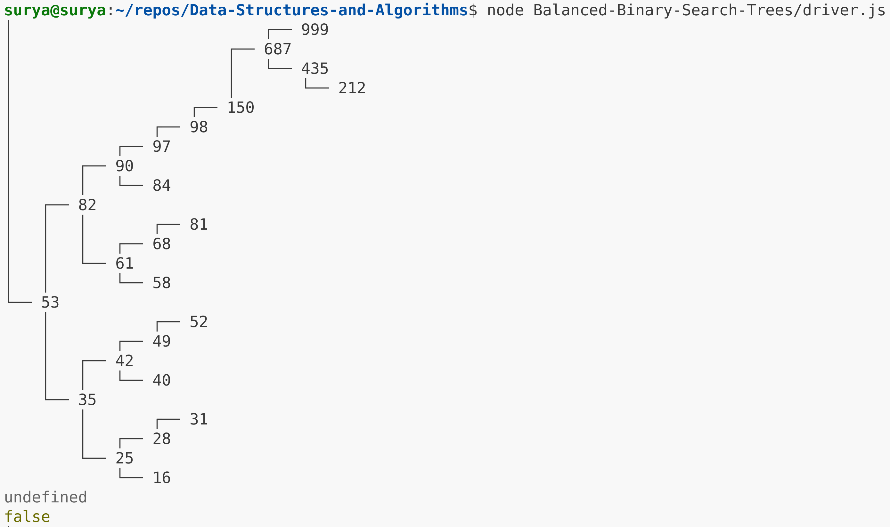
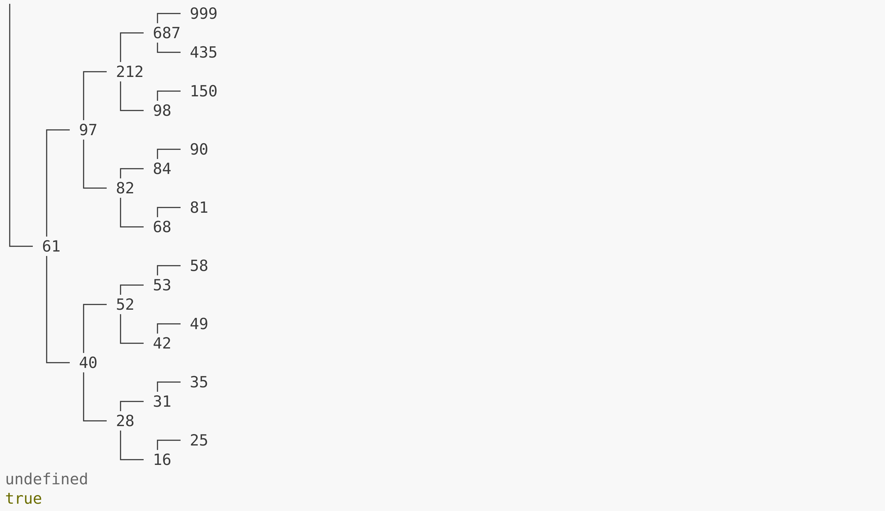
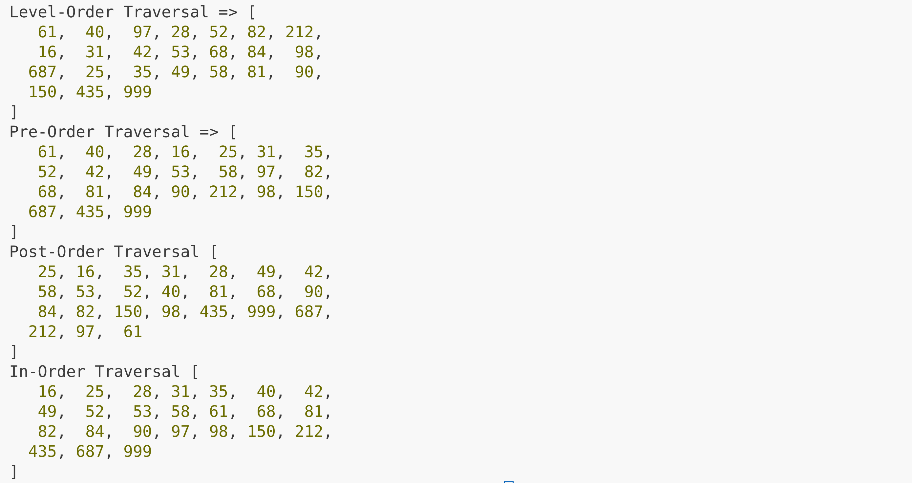
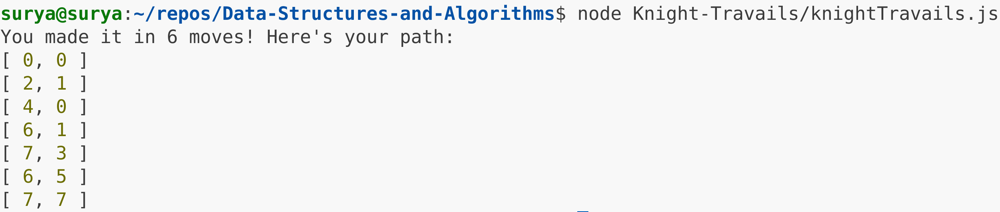

# Data-Structures-and-Algorithms

This repository is a compilation of some key Data Structures and Algorithms in Computer Science that I coded in JavaScript to bolster my problem-solving skills. Each of the data structures & algorithms were built from scratch after learning and understanding the logic behind their working using various internet sources. Finally, a sort of capstone project that makes use of many of the learned data structures and algorithms was developed, which is also included here.

## Summary

- [Recursion](#recursion)
- [Linked-Lists](#linked-list)
- [HashMap-HashSet](#hashmap-hashset)
- [Balanced Binary Search Trees](#balanced-binary-search-trees)
- [Knight Travails](#knight-travails)
- [Project Repositories](#project-repositories)

## Recursion

Recursion is one of the fundamental concepts in Computer Science that makes use of the Divide & Conquer algorithm. It involves taking a complex task and breaking it down repeatedly until the simplest form of the problem is achieved. This unit is then solved, whose result is passed to the one it was derived from, which then uses it to solve itself and pass that result to its parent and so on. Thus, the entire chain unravels all the way back to the top, solving the main problem.

To become proficient with recursion, two simple concepts were implemented:

### The Fibonacci Sequence

The Fibonacci Sequence is one of the simpler mathematical sequences that follows the simple idea that a number is the sum of the two numbers before it. The sequence is as follows 0, 1, 1, 2, 3, 5, 8, 13, 21, and so on. Once I understood the concept, I implemented it first using simple iteration and then following suit with recursion.

#### Implementation

For the full implementation of the Fibonacci Sequence, please refer to the [Source Code](./Recursion/fibonacci.js).

#### Sample Output

<div align=center> 
  
</div>

### MergeSort

MergeSort as the name implies is a Sorting Algorithm. It works on the basis of the "Divide and Conquer" approach, where a given list of elements is repeatedly sliced in half, resulting in left and right halves, which when they become just one element each, are compared, sorted and then combined together to form a fully sorted whole.

#### Implementation

For the full implementation of MergeSort Algorithm, please refer to the [Source Code](./Recursion/mergeSort.js).

#### Sample Output

<div align=center> 
  
</div>

## Linked List

A Linked List is a dynamic data structure which is a variation of conventional arrays/lists that allows for easy insertion or deletion of elements. While most programming languages now allow these operations with arrays/lists, Linked Lists happens to be one of, if not the easiest dynamic data structure to learn which also has applications in more complex data structures such as HashMaps, thus I familiarized myself with its workings.

### Features

- **`append(value)`** - adds a new node containing `value` to the end of the list

- **`preppend(value)`** - adds a new node containing `value` to the start of the list

- **`size()`** - returns the total number of nodes in the list

- **`getHead()`** - returns the first node in the list

- **`tail()`** - returns the last node in the list

- **`at(index)`** - returns the node at the given `index`

- **`pop()`** - removes the last element from the list

- **`contains(value)`** - returns _true_ if `value` is in the list and otherwise returns _false_

- **`find(value)`** - returns the index of the node with `value`, or _null_ if not found

- **`toString()`** - returns a formatted string version of the current linked list

- **`insertAt(value, index)`** - inserts a new node with the provided `value` at the given `index`

- **`removeAt(index)`** - removes the node at the given `index`

### Implementation

For the full implementation of the Linked List, please refer to the [Source Code](./Linked-List/linkedList.js).

### Sample Output

```javascript
const list = new LinkedList();

list.append("dog");
list.append("cat");
list.append("parrot");
list.append("hamster");
list.append("snake");
list.append("turtle");

list.prepend("cow");

list.pop();

list.insertAt("chicken", 5);

list.removeAt(0);

console.log(list.toString());
```

<div align=center> 
  
</div>

For the testing of all the Linked List methods, please refer to the [Driver Code](./Linked-List/main.js).

## HashMap-HashSet

HashMap is one of the most efficient data structures out there with the capability to operate with an average complexity of _O(1)_ across insert, fetch and remove operations. This awesome efficiency is possible due to its structure which combines arrays and linked lists by way of Hash codes and Buckets. Hash codes are derived by hashing keys (data) that we want to store using some algorithm or unique method such that each element in the array has a unique hash code. Each hash code essentially acts as an index in the array and at each index, we the store the data that corresponds to its hash code. What are Buckets then? Buckets are essentially linked lists that contain all the data corresponding to a hash code. But why use linked lists at all? A hash map, as efficient as it is, still only has a limited amount of space, so there can only be so many hash codes and there is a chance that two different data generate the same hash code, leading to a Collision, thus to prevent such collisions, linked lists, i.e., buckets were implemented. How exactly do Linked Lists solve this problem? Let's say that some data unit generates a hash code and we try to add the data to the corresponding index, if that index is empty, then we simply add the data as the head of the linked list but on the other hand, if there's already some data that exists in that hash code index, then we add the current data to the tail of the linked list, preventing collisions. HashSets work the same way as HashMaps but they only contain keys with no values.

### Features

- **`hash(key)`** - takes a `key` (data) and produces a hash code with it

- **`set(key, value)`** - creates an entry with `value` assigned to a `key`. If adding a new key exceeds the current capacity of the HashMap, i.e., load factor, its size, i.e., the number of buckets is doubled.

- **`get(key)`** - returns the value that is assigned to `key`

- **`has(key)`** - returns _true_ or _false_ based on whether the `key` is in the hash map or not

- **`remove(key)`** - removes the entry with the given `key` if it exists, returns false otherwise

- **`length()`** - returns the number of stored keys in the HashMap

- **`clear()`** - removes all entries in the HashMap

- **`keys()`** - returns an array containing all the keys inside the HashMap

- **`values()`** - returns an array containing all the values inside the HashMap

- **`entries()`** - returns an array containing all key-value pairs inside the HashMap

### Implementation

For the full implementation of the HashMap, please refer to the [Source Code](./HashMap%20HashSet/hashMap.js).

### Sample Output

```javascript
const hashMap = new HashMap(16, 0.75);

hashMap.set("apple", "red");
hashMap.set("banana", "yellow");
hashMap.set("carrot", "orange");
hashMap.set("dog", "brown");
hashMap.set("elephant", "gray");
hashMap.set("frog", "green");
hashMap.set("grape", "purple");
hashMap.set("hat", "black");
hashMap.set("ice cream", "white");
hashMap.set("jacket", "blue");
hashMap.set("kite", "pink");
hashMap.set("lion", "golden");

// Overwriting few nodes
hashMap.set("apple", "dark-red");
hashMap.set("jacket", "black");
hashMap.set("lion", "brown");

console.log(hashMap);
console.log(hashMap.entries());
```

<div align=center>
  
</div>

For the testing of all the HashMap and HashSet methods, please refer to the [Driver Code](./HashMap-HashSet/main.js).

### Project Plan

For a detailed thought process and planning behind implementing the HashMap, please refer to its [Project Plan Document](./HashMap-HashSet/project-plan.md).

## Balanced Binary Search Trees

Binary Search Trees (BST) is a tree-like data structure with root nodes, and left and right child nodes for each root node, such that the left child is always smaller than the root and the right child is always larger than the root. Its one of the best data structures for sorting operations and working with arrays in general with an average Time Complexity of _O(log n)_. The BST can be made even more efficient by balancing it, where duplicate values are removed and the difference between the left and right childs is not more than one. Different methods of traversing the Balanced BST were also explored, with the Breadth First Search algorithm faciliating Level-Order traversal and Depth First Search algorithm facilitating In-Order, Pre-Order, & Post-Order Traversal.

### Features

- **`insert(data)`** - creates a Node with the given `data` and inserts in the tree

- **`deleteItem(data)`** - deletes the Node that contains `data` from the tree

- **`find(data)`** - returns the node that contains `data`

- **`height(node)`** - returns the height of the given `node` in the tree

- **`depth(node)`** - returns the depth of the given `node` in the tree

- **`isBalanced()`** - checks if tree is balanced

- **`rebalance()`** - rebalances the tree

### Tree Traversal Methods

#### BFS Approach

The Balanced BST is traversed in a Breadth-first manner, meaning each layer or row in the tree is fully traversed before moving down the next layer. This approach is based on a queue data structure and is known as Level-Order Traversal.

#### DFS Approach

The Balanced BST is traversed in a Depth-first manner, meaning for each node, its entire depth down the tree is fully traversed before moving on to the next node. This approach is based on a stack structure and there are three ways to traverse the tree in depth-first manner:

- **In-Order Traversal** - _(Left, Root, Right)_ - In this traversal, the left children are all visited first, followed by the root nodes, and finishing with the right children. In-Order traversal of a Binary Search Tree results in a fully sorted array.
- **Pre-Order Traversal** - _(Root, Left, Right)_ - In this traversal, the root nodes are all visited first, followed by the left children, and finishing with the right children.
- **Post-Order Traversal** - _(Left, Right, Root)_ - In this traversal, the left & right children of each root node are visited before visiting the root nodes themselves.

### Implementation

For the full implementation of the Balanced Binary Search Tree and its Traversal methods, please refer to the [Source Code](./Balanced-Binary-Search-Trees/tree.js).

### Sample Output

```javascript
const arr = randomNumsArray(20);
let displayArr = [];
const tree = new Tree();
tree.buildTree(arr);

// Unbalance tree
tree.insert(150);
tree.insert(687);
tree.insert(435);
tree.insert(212);
tree.insert(999);
console.log(prettyPrint(tree.root));
console.log(tree.isBalanced());

// Rebalance tree
tree.rebalance();
console.log(prettyPrint(tree.root));
console.log(tree.isBalanced());

// levelOrder Traversal
tree.levelOrder(tree.root, displayElements);
console.log("Level-Order Traversal =>", displayArr);
displayArr = [];

// preOrder Traversal
tree.preOrder(tree.root, displayElements);
console.log("Pre-Order Traversal =>", displayArr);
displayArr = [];

// postOrder Traversal
tree.postOrder(tree.root, displayElements);
console.log("Post-Order Traversal", displayArr);
displayArr = [];

// inOrder Traversal
tree.inOrder(tree.root, displayElements);
console.log("In-Order Traversal", displayArr);
displayArr = [];
```

<div align=center>
  
</div>
<div align=center>
  
</div>
<div align=center>
  
</div>

For a more detailed look at the testing of the BST methods, please refer to the [Driver Code](./Balanced-Binary-Search-Trees/driver.js).

### Project Plan

For a detailed thought process and planning behind implementing the Balanced Binary Search Tree, please refer to its [Project Plan Document](./Balanced-Binary-Search-Trees/project-plan.md).

## Knight Travails

This project aimed to predict the shortest path that a Knight piece can take on a chess-board to go from a starting position (cell) to a destination position. A knight’s valid moves from any square (vertex) can be thought of as the edges (connections) between the vertices and given enough turns, a knight on a standard 8x8 chess board can move from any square to any other square. Thus, the problem of finding the shortest path for the knight’s movement becomes a graph traversal problem. This problem was solved by using a number of Computer Science concepts in combination.

### Features

- **Graph-based Hybrid Data Structure** - The data structure used for the project is a hybrid of a matrix and an adjacency list, where the matrix represents the 8x8 chess-board and the adjacency list is essentially used inside each of the cells to store all the valid moves that a knight can make from that cell.

- **BFS Algorithm** - Breadth First Search Algorithm was utilized to find the shortest path that a knight can take to get from one cell to another cell. For each cell, the cell is first marked as visited. Then, for each adjacent cell of the current cell,

  - it is marked as visited
  - it is stored in an array (for backtracking) as an object with a,
    - `prev` property containing its previous cell (the current one which had it as an adjacent)
    - `adjCell` property containing the cell itself as the adjacent of the current one.
  - it is pushed to the queue

  The same process continues for the newly added adjacent cells in the queue, until one of the cells encountered is the destination cell.

- **Recursion** - Recursion is used to find the shortest path from the source to the destination cell by backtracking, made possible with the backtracking array, which contains all the cells (with their previous cell) the BFS traversal encountered. Recursion logic:

  - **Base case:** When `dst` (destination) equals `src` (source), stop the recursion and return the source node.
  - **Recursion case:** For each object in the backTrack array,
    - Check if the adjacent cell of that object equals `dst`
    - If it does,
      - make the `prev` cell of that object the dst
      - add the adjacent cell to an array
      - call the function again with the backTrack array, same `src`, and the updated `dst` inside a `concat()` function.

  The recursion keeps happening until the base case is true and the final output is an array containing the cells that represent the shortest path from the destination to the source cell. The array is then processed and the shortest path is returned.

- **`O(V + E)` Time Complexity** - The main function of the project runs in `O(V + E)` Time Complexity

  - The chess-board contains `8 x 8 = 64` cells (vertices), so its worst complexity is `O(V) = O(64)`.
  - From each cell, a knight can make a total of 8 possible moves (edges), so its worst complexity is `O(8V) = O(8 * 64) = O(512)`.
  - The time complexity of the BFS algorithm is given by `O(V + E) = O(64 + 512) = O(576)`.
  - Backtracking Complexity using Recursion at the worst case from source cell `[0, 0]` to destination cell `[7, 7]` is 6 moves, so the worst complexity is `O(k)` where `k <= 6`.
  - Thus, the total is `O(576) + O(6)` but `O(k)` is negligible compared to `O(576)`, thus the Worst Case Time Complexity is `O(V + E)`.

### Implementation

For the full implementation of the Knight Travails project, please refer to the [Source Code](./Knight%20Travails/knightTravails.js).

### Sample Output

```javascript
function knightMoves(src, dst) {
  let q = [],
    backTrackArr = [];

  visited[src[0]][src[1]] = true;
  let firstCell = knightTravails[src[0]][src[1]];
  for (const adjCells of firstCell) {
    backTrackArr.push({ prev: src, adjCell: adjCells });
    q.push(adjCells);
  }

  while (q.length) {
    const curr = q.shift();
    let knightTravArr = knightTravails[curr[0]][curr[1]];
    visited[curr[0]][curr[1]] = true;

    for (const x of knightTravArr) {
      if (!visited[x[0]][x[1]]) {
        visited[x[0]][x[1]] = true;
        backTrackArr.push({ prev: curr, adjCell: x });
        q.push(x);
      }

      if (x[0] === dst[0] && x[1] === dst[1]) {
        return finalOutput(getShortestPath(backTrackArr, src, dst));
      }
    }
  }
}

knightMoves([0, 0], [7, 7]);
```

<div align=center>
  
</div>

## Project Repositories

For the workflow of the aforementioned projects, including the commits and diff changes, please refer to their respective GitHub repositories.

- [Linked-Lists](https://github.com/Suryakumar-Selvakumar/Linked-Lists)
- [HashMap-HashSet](https://github.com/Suryakumar-Selvakumar/HashMap-HashSet)
- [Balanced Binary Search Trees](https://github.com/Suryakumar-Selvakumar/Binary-Search-Trees)
- [Knight Travails](https://github.com/Suryakumar-Selvakumar/Knight-Travails)

<div align="right">
  <a href="#data-structures-and-algorithms" style="font-weight: bold">&uarr; Back to top</a>
</div>
